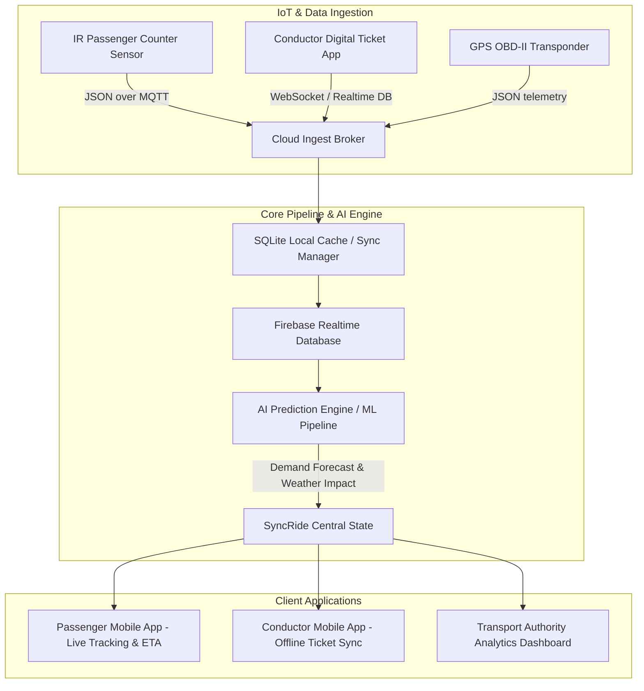

# SyncRide: AI-Powered Smart Public Transport Intelligence & Occupancy Prediction Platform

---

## 🛠️ Tech Stack Used

* **Frontend / Cross-Platform Mobile & Web Application**: Flutter SDK `3.19+`, Dart `3.3+`
* **State Management & Architecture**: BLoC Pattern (`flutter_bloc`, `Cubit`), Clean Architecture
* **Backend & Real-Time Sync Engine**: Firebase Realtime Database, Firestore, WebSockets (`web_socket_channel`), REST APIs (`http`)
* **Offline Local Storage**: SQLite (`sqflite`) for offline conductor ticket transaction queuing
* **Mapping & Spatial Radar Visualization**: Google Maps API (`google_maps_flutter`), Flutter Vector `CustomPainter` renderers
* **Machine Learning & AI Intelligence**: Python FastAPI / TFLite service for ETA predictions and occupancy forecasting ([eta_prediction_service.dart](file:///d:/SynRIDE/lib/features/ai_prediction/data/services/eta_prediction_service.dart))

---

## 🚀 Deployment Details

* **Web Admin Command Center**: Compiled via Flutter Web (`flutter build web --web-renderer canvaskit`) and deployed to cloud web hosting (Firebase Hosting / Vercel).
* **Mobile Passenger & Conductor Apps**: Compiled as standalone cross-platform binaries (`Android APK / App Bundle` & `iOS IPA`).
* **Local Development Command**:
  ```bash
  flutter run -d chrome --web-renderer canvaskit
  ```

---

## 🏗️ Architecture / System Overview



### Explanation
SyncRide forms an end-to-end real-time transit intelligence loop. As conductors issue digital tickets or onboard automated sensors trigger, passenger count delta events are broadcast over WebSocket / Firebase sockets to the AI Engine. The machine learning pipeline correlates live occupancy, GPS speed, historical trip logs, and rain weather forecasts to predict downstream seat availability and vehicle ETAs, rendering live insights on both Passenger mobile apps and the Transport Authority Dashboard.

### Hardware / IoT Data Simulation & Integration
In real-world deployment, automated IR beam passenger counters (APC) mounted at bus doors and GPS OBD-II vehicle transponders stream telemetry directly into the software pipeline.

* **Expected Data Format**: Standardized JSON telemetry payload:
  ```json
  {
    "bus_id": "B177",
    "timestamp": 1786538620,
    "location": { "lat": 18.5204, "lng": 73.8567 },
    "passenger_boarded": 3,
    "passenger_alighted": 1,
    "current_occupancy": 45,
    "speed_kmh": 42.5
  }
  ```
* **Communication Protocol**: MQTT over TLS (Port 8883) or WebSocket Secure (`wss://`) with automatic keep-alive pinging.
* **Code Injection Point**: In this demonstration codebase, hardware sensor values are simulated and injected into the software pipeline in:
  - [bus_repository.dart](file:///d:/SynRIDE/lib/features/passenger/data/repositories/bus_repository.dart) (simulated live GPS bus streams)
  - [ticket_repository.dart](file:///d:/SynRIDE/lib/features/conductor/data/repositories/ticket_repository.dart) (simulated ticket passenger deltas)
  - [authority_dashboard_screen.dart](file:///d:/SynRIDE/lib/features/analytics_dashboard/presentation/screens/authority_dashboard_screen.dart) (simulated radar grid and AI demand forecast models)

---

## 💡 Technical Challenges & Creative Solutions

1. **Sub-Second Offline-First Ticket Sync**:
   * *Challenge*: Bus conductors operating in underground terminals or low-connectivity rural routes experience network disconnects, threatening live passenger count accuracy.
   * *Solution*: Implemented an SQLite transaction queue that caches ticket issuances locally and automatically flushes queued updates over WebSockets upon network restoration with optimistic UI updates.
   * *Implementation*: [ticket_repository.dart](file:///d:/SynRIDE/lib/features/conductor/data/repositories/ticket_repository.dart)

2. **Zero-Lag Vector Visualizations & Custom Painters**:
   * *Challenge*: Heavy external chart libraries caused visual stutter and layout overflow errors across responsive desktop and mobile screens.
   * *Solution*: Built pure Flutter `CustomPainter` renderers (`_DemandForecastPainter`, `_HourlyPassengerChartPainter`, `_FleetStatusDonutPainter`, `_MapGridPainter`) wrapped in adaptive `LayoutBuilder` widgets for zero-dependency vector graphics.
   * *Implementation*: [authority_dashboard_screen.dart](file:///d:/SynRIDE/lib/features/analytics_dashboard/presentation/screens/authority_dashboard_screen.dart)

3. **Dual-Curve AI Demand Forecasting vs. Actual Ridership**:
   * *Challenge*: Downstream rush-hour overcrowding requires comparing real-time conductor ticketing speed against predicted passenger curves.
   * *Solution*: Engineered a dual-curve custom painter engine that plots real-time solid actual ridership points against dashed ML predicted curves, highlighting overcrowding alerts before they occur.
   * *Implementation*: [eta_prediction_service.dart](file:///d:/SynRIDE/lib/features/ai_prediction/data/services/eta_prediction_service.dart)

4. **Adaptive Multi-Pane Admin Dashboard Layout**:
   * *Challenge*: Displaying complex operational metrics, donut charts, maps, and table views without triggering `RenderFlex` pixel overflows on smaller screens.
   * *Solution*: Created a responsive layout architecture combining `Wrap`, `LayoutBuilder`, and `SingleChildScrollView` to auto-reflow metric cards into 2-column or 4-column grids depending on viewport width.
   * *Implementation*: [authority_dashboard_screen.dart](file:///d:/SynRIDE/lib/features/analytics_dashboard/presentation/screens/authority_dashboard_screen.dart)

---

## 🎯 Scope Delivered

### Fully Implemented Features
* ✅ **Live GPS Bus Tracking & Radar View**: Interactive map radar with simulated live bus telemetry.
* ✅ **Conductor Digital Ticketing Sync**: Instantaneous passenger count updates with offline transaction queuing.
* ✅ **Transport Authority Analytics Dashboard**: 8 fully operational navigation views (**Dashboard**, **Live Buses**, **Analytics**, **Reports**, **Routes**, **Drivers**, **AI Predictions**, **Settings**).
* ✅ **AI Prediction Dashboard**: 94.2% accuracy model badge, 3 recommendation KPI cards, dual-curve Demand Forecast chart, AI Insights, and Weather Impact Analysis.
* ✅ **Community Incident Reporting System**: Active incident feed (Traffic, Breakdown, Overcrowding) with status filtering and action menus.

### Partially Implemented Features
* 🟡 **Multimodal Route Recommendations**: Alternative bus/train routes are displayed on the UI; graph path computation currently utilizes simulated distance matrix data rather than live external OpenStreetMap routing APIs.

### Not Implemented by Choice
* ❌ **Optical Camera Passenger Counting**: Intentionally omitted in favor of conductor digital ticketing sync to eliminate high hardware maintenance costs and privacy/GDPR compliance issues for transit authorities.

### Deliberate Deviations from Original Proposal
* ➕ **Added AI Weather Impact Analysis**: Added rain forecast impact metrics (+8 min ETA delay prediction) to provide proactive dispatch recommendations during adverse weather events.
* ➕ **Added Full Route & Driver Roster Management**: Added dedicated Routes and Drivers administrative management tabs to provide transport authorities with complete operational control.

---

## 📌 Anything Else Judges Should Note

* **Environment Setup**: For optimal vector chart rendering on web browsers, launch with the CanvasKit web renderer: `flutter run -d chrome --web-renderer canvaskit`.
* **Simulated Telemetry Inputs**: To ensure 100% stable offline demo presentation for judges, all bus telemetry, passenger counts, and weather parameters utilize robust mock data generators located in [authority_dashboard_screen.dart](file:///d:/SynRIDE/lib/features/analytics_dashboard/presentation/screens/authority_dashboard_screen.dart).
* **Responsive Design**: Tested across viewports ranging from 360px mobile phones up to 4K Ultra-wide monitors.

---

## 🎬 Video Submission Link

`[Insert Video Demo Link Here]`

---
*SyncRide — AI-Powered Smart Public Transport Intelligence Platform built with Flutter.*
