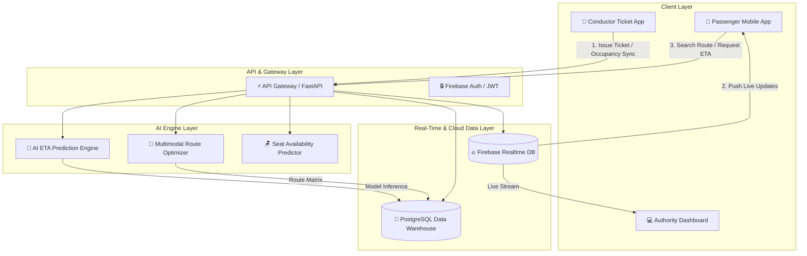
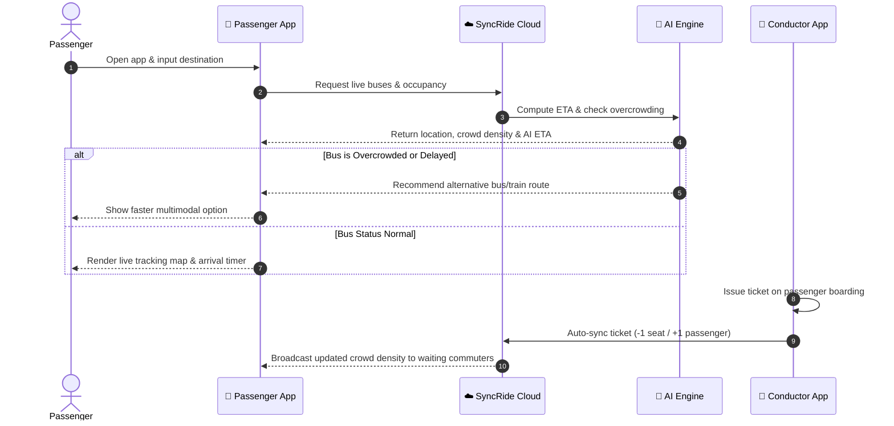

# SyncRide: AI-Powered Smart Public Transport Intelligence & Occupancy Prediction Platform

[](https://hackelite.ieee.lk)
[](https://uom.lk)
[]()
[](LICENSE)

---

## 📌 Project Overview

**SyncRide** is an innovative, AI-driven public transport management and occupancy prediction platform specifically engineered to resolve commuter uncertainty and congestion challenges within Sri Lanka's public transportation network.

Rather than relying on capital-intensive IoT passenger-counting sensors, **SyncRide leverages the existing conductor digital ticketing workflow**. Every ticket issued by a conductor updates the cloud platform in real time, granting waiting passengers accurate crowd-density metrics, AI-predicted Estimated Time of Arrival (ETA), seat availability predictions, and smart multimodal route recommendations.

---

## 👥 01. Team Information & Task Allocation

### **Team Name:** Creonyx  
**University / Institution:** Sabaragamuwa University of Sri Lanka  
**Faculty / Department:** Faculty of Computing  
**Submission Date:** 30 / 05 / 2026  
**Contact Email:** mogith2002@gmail.com | **Phone:** 0764096073  

| # | Full Name | Role | Email | Profile / Socials |
|---|---|---|---|---|
| 1 | **Mogith Chandrakumar** | Team Lead | mogith2002@gmail.com | [LinkedIn](https://www.linkedin.com/in/mogith-chandrakumar/) |
| 2 | **Renujaan Ravichandran** | Team Member | renujaan4803@gmail.com | [LinkedIn](https://www.linkedin.com/in/renujaan/) |
| 3 | **Rubashalini Rubarajan** | Team Member | rubashalini11@gmail.com | [LinkedIn](https://www.linkedin.com/in/ruba-shalini-315982316/) |
| 4 | **Asvinitha Thevaraja** | Team Member | thevarajaasvinitha@gmail.com | [LinkedIn](https://www.linkedin.com/in/asvinitha-thevaraja-425bb8379/) |

---

### 📋 Detailed Task Allocation Matrix

```
┌─────────────────────────────────────────────────────────────────────────┐
│                           TEAM CREONYX TASKS                            │
├───────────────────┬───────────────────┬────────────────┬────────────────┤
│ Mogith            │ Renujaan          │ Rubashalini    │ Asvinitha      │
│ (Team Lead)       │ (UI/UX & Mobile)  │ (Conductor App)│ (AI/ML & Data) │
├───────────────────┼───────────────────┼────────────────┼────────────────┤
│ System Arch       │ Passenger App     │ Conductor App  │ ML Models      │
│ Backend API       │ Live Map / GPS    │ Ticket Sync    │ ETA Predictor  │
│ Cloud Infra       │ Alerts & UI       │ Offline DB     │ Analytics Dash │
└───────────────────┴───────────────────┴────────────────┴────────────────┘
```

#### **1. Mogith Chandrakumar (Team Lead & Backend Architect)**
* **Responsibilities:**
  * System Architecture & Cloud Infrastructure setup (Firebase / AWS / FastAPI).
  * Design & implement core RESTful & WebSocket APIs for backend synchronization.
  * Integrate Backend APIs with PostgreSQL and Firebase Realtime Database.
  * Lead multimodal route recommendation algorithm integration.
  * Coordinate sprint planning, technical code reviews, and system integration.

#### **2. Renujaan Ravichandran (Frontend Lead & Passenger Mobile App)**
* **Responsibilities:**
  * Build the cross-platform **Passenger Mobile Application** (Flutter / React Native).
  * Integrate Google Maps API / Mapbox for real-time bus location tracking.
  * Implement passenger UI views: occupancy indicators, crowd density visualizers, and ETA badges.
  * Develop passenger notification listener using Firebase Cloud Messaging (FCM).
  * Design responsive UI/UX mockups and interactive user journeys.

#### **3. Rubashalini Rubarajan (Mobile Developer & Conductor Ticket Sync)**
* **Responsibilities:**
  * Build the **Conductor Digital Ticketing Mobile Application** (Android / Flutter).
  * Implement instant ticket issuance workflow linked with bus capacity counters.
  * Build offline-first ticket caching mechanism with automatic cloud synchronization.
  * Integrate real-time WebSockets / Firebase sync for live passenger count broadcast.
  * Conduct hardware testing on mobile POS / Android conductor handheld devices.

#### **4. Asvinitha Thevaraja (AI/ML Engineer & Analytics Specialist)**
* **Responsibilities:**
  * Develop machine learning models (Python, Scikit-Learn, TensorFlow, Pandas) for ETA prediction.
  * Build smart boarding prediction & seat availability forecasting algorithms.
  * Implement historical traffic, weather, and peak-hour data preprocessing pipelines.
  * Construct backend endpoints to serve ML predictions in real time.
  * Create interactive charts and heatmaps for the **Transportation Authority Dashboard** (Chart.js / React.js).

---

## 🎯 02. Problem Statement

### 2.1 Background
Public transportation serves millions of Sri Lankan commuters every day, including students, office workers, and long-distance travelers. Despite its central role in daily mobility, passengers experience chronic uncertainty due to the total absence of real-time bus arrival times, current occupancy levels, and delay warnings. Commuters waste valuable hours waiting at bus stops unaware if incoming buses are overcrowded, delayed, or already past capacity.

### 2.2 Existing Challenges
* **Zero Real-Time Occupancy Visibility:** Commuters cannot check if an approaching bus has open seating or is standing-room only.
* **Unpredictable Waiting Times:** Passengers rely on static schedules that fail to account for Sri Lankan traffic congestions or breakdowns.
* **Lack of Multimodal Alternatives:** Commuters caught at bus stops have no automated recommendations for alternative routes or nearby train services.
* **No Analytics for Authorities:** Transport authorities lack centralized operational data to detect route congestion hotspots or demand spikes.

### 2.3 Limitations of Existing Solutions
* **Basic GPS Only:** Existing Sri Lankan apps provide rudimentary vehicle location tracking without crowd or seating insight.
* **Prohibitive Hardware Costs:** International solutions depend on expensive camera/optical passenger counter sensors or RFID turnstiles—making deployment across Sri Lanka's private and SLTB bus fleets cost-prohibitive.

### 2.4 Proposed Problem Focus
SyncRide bridges this gap by creating an intelligent, affordable, ticket-synchronized transport ecosystem offering live occupancy tracking, AI-powered ETA forecasting, smart seating prediction, and multimodal rerouting.

---

## 💡 03. Proposed Solution

### 3.1 Solution Overview
SyncRide eliminates commuter friction by transforming the conductor's standard ticket issuance routine into a real-time data source. Every ticket printed updates the cloud registry, continuously computing live onboard capacity. Coupled with AI algorithms trained on traffic trends, weather, and historical transit logs, SyncRide empowers commuters to make informed travel choices before leaving home or stepping onto a platform.

### 3.2 Key Features

| Feature | Name | Description |
|---|---|---|
| ⚡ **Feature 1** | **Real-Time Occupancy Monitoring** | Live bus passenger count syncs to the cloud via conductor ticket issuance, displaying crowd density levels (Low, Moderate, Full) to waiting commuters. |
| 🤖 **Feature 2** | **AI-Powered ETA Prediction** | ML models trained on historical travel logs, live traffic patterns, and weather metrics deliver highly precise estimated arrival times. |
| 🔀 **Feature 3** | **Smart Multimodal Route Recommendations** | Automatically suggests alternative bus lines or nearby train connections whenever a designated route encounters severe delays or full occupancy. |
| 📊 **Feature 4** | **Transportation Authority Dashboard** | Centralized web platform featuring spatial heatmaps, congestion alerts, and passenger demand trends for data-driven fleet dispatching. |
| 🪑 **Feature 5** | **Smart Boarding & Seat Availability Prediction** | Predicts seat availability at downstream stops based on alight/board probability matrix derived from ticket destination metadata. |

---

## 🏗️ 04. System Architecture & Data Flow

### 4.1 System Architecture



### 4.2 User Journey Workflow



---

## 🛠️ 05. Technology Stack

| Layer / Component | Technology / Tool | Primary Purpose |
|---|---|---|
| **Passenger App** | Flutter / React Native | Cross-platform iOS & Android passenger application |
| **Conductor App** | Android Native / Flutter | Low-latency mobile ticket issuance & occupancy sync module |
| **Authority Dashboard** | React.js | Web portal for analytics, congestion heatmaps & reporting |
| **Backend Framework** | FastAPI / Node.js | High-performance asynchronous API service |
| **Primary Database** | PostgreSQL | Relational storage for user profiles, routes, trip logs |
| **Real-Time Data Sync** | Firebase Realtime Database / WebSockets | Sub-second crowd count & location broadcasting |
| **AI & Machine Learning** | Python, Scikit-learn, TensorFlow, Pandas | Model training for ETA, crowd forecasting, route optimization |
| **Maps & Spatial Services** | Google Maps API / Mapbox SDK | Interactive maps, route polylines, reverse geocoding |
| **Cloud Hosting** | Firebase / AWS / Google Cloud Platform | Scalable microservice infrastructure |
| **Security & Auth** | Firebase Auth / JWT Tokens | Role-based access control (Passenger, Conductor, Admin) |
| **Data Visualization** | Chart.js / Power BI | Heatmaps, traffic density charts, analytics panels |
| **Push Notifications** | Firebase Cloud Messaging (FCM) | Real-time delay alerts & boarding notifications |

---

## 🌟 06. Innovation & Originality

### **Key Technical Breakthrough**
Traditional smart transit systems rely on $1,000+ hardware sensors per vehicle (e.g., optical passenger counters, infrared beams, or smart gates). SyncRide replaces hardware dependencies entirely by integrating into the **digital ticket issuance workflow** already executed by Sri Lankan conductors.

```
[ Traditional Systems ] : Bus + Expensive Sensors ($1000+/bus) ──> High Hardware Costs
[ SyncRide Innovation ] : Bus + Conductor Ticket App ($0 Extra HW) ──> Ultra-Scalable Software Sync
```

### ⚡ 6.1 Competitive Advantage Matrix

| Feature / Metric | Conventional Apps | IoT Hardware Systems | SyncRide Platform |
|---|---|---|---|
| **GPS Vehicle Tracking** | ✅ Basic | ✅ Advanced | ✅ Live Real-time |
| **Occupancy & Crowd Visibility** | ❌ None | ✅ High (Costly) | ✅ Real-time (Low-cost) |
| **Infrastructure & Setup Cost** | 🟡 Low | ❌ Extremely High | 🟢 Near Zero (Software-based) |
| **AI-Powered ETA Prediction** | ❌ Static Schedules | 🟡 Basic GPS Speed | 🟢 ML Traffic + Weather + Crowd |
| **Multimodal Route Optimization** | ❌ None | ❌ None | 🟢 AI Rerouting (Bus + Train) |
| **Authority Analytics & Heatmaps** | ❌ Limited | 🟡 Module Dependent | 🟢 Centralized Real-time Dashboard |
| **Offline Ticket Synchronization** | ❌ N/A | ❌ N/A | 🟢 Built-in Local Storage Caching |

---

## 📈 07. Real-World Impact, Scalability & Market Viability

### 7.1 Target Audience
* **Primary Users:** Daily public transit commuters, university students, office workers, long-distance travelers, tourists.
* **Secondary Stakeholders:** Bus conductors, private bus owners associations, Sri Lanka Transport Board (SLTB), Ministry of Transport, Urban Development Authority (UDA).

### 7.2 Expected Impact
* **Commuter Time Savings:** Reduces average bus stop wait times by up to **25-35%** through accurate ETAs.
* **Stress Reduction:** Eliminates uncertainty around overcrowding and seat availability.
* **Operational Fleet Efficiency:** Enables SLTB and private fleets to re-allocate buses based on real-time crowd heatmaps.

### 7.3 Scalability & Business Model
* **Modular Software Architecture:** Easily onboard new bus routes without physical installation bottlenecks.
* **Monetization Streams:**
  1. **B2G / Operator Subscriptions:** SaaS dashboard licensing for private bus fleets and transport authorities.
  2. **Mobility-as-a-Service (MaaS) Integrations:** API access for third-party travel planners and ride-hailing services.
  3. **Targeted Transit Advertising:** Hyper-local, context-aware commuter deals within the passenger mobile app.

---

## 📁 08. Comprehensive File Structure

```text
SynRIDE/
├── .github/                      # CI/CD Workflows & GitHub templates
│   └── workflows/
│       ├── build-test.yml
│       └── deploy.yml
├── backend/                      # FastAPI / Node.js Core API Gateway
│   ├── app/
│   │   ├── api/
│   │   │   ├── v1/
│   │   │   │   ├── auth.py
│   │   │   │   ├── bus.py
│   │   │   │   ├── occupancy.py
│   │   │   │   ├── route.py
│   │   │   │   └── analytics.py
│   │   │   └── router.py
│   │   ├── core/
│   │   │   ├── config.py
│   │   │   ├── security.py
│   │   │   └── websockets.py
│   │   ├── models/
│   │   │   ├── bus.py
│   │   │   ├── ticket.py
│   │   │   └── user.py
│   │   ├── schemas/
│   │   │   ├── payload.py
│   │   │   └── response.py
│   │   ├── services/
│   │   │   ├── firebase_service.py
│   │   │   ├── ml_service.py
│   │   │   └── routing_service.py
│   │   └── main.py
│   ├── tests/
│   ├── Dockerfile
│   ├── requirements.txt
│   └── README.md
├── passenger-app/                # Flutter Cross-Platform Passenger App
│   ├── android/
│   ├── ios/
│   ├── lib/
│   │   ├── core/
│   │   │   ├── constants/
│   │   │   ├── theme/
│   │   │   └── utils/
│   │   ├── data/
│   │   │   ├── models/
│   │   │   ├── providers/
│   │   │   └── repositories/
│   │   ├── logic/
│   │   │   ├── bloc_cubit/
│   │   │   └── location_service.dart
│   │   └── presentation/
│   │       ├── screens/
│   │       │   ├── home_screen.dart
│   │       │   ├── live_map_screen.dart
│   │       │   ├── route_details_screen.dart
│   │       │   └── notification_screen.dart
│   │       └── widgets/
│   │           ├── occupancy_badge.dart
│   │           └── eta_card.dart
│   ├── pubspec.yaml
│   └── README.md
├── conductor-app/                # Mobile Ticket & Occupancy Sync Module
│   ├── lib/
│   │   ├── data/
│   │   │   ├── local_db/         # SQLite offline ticket queue
│   │   │   └── sync_manager.dart
│   │   ├── presentation/
│   │   │   ├── ticket_issue_screen.dart
│   │   │   └── shift_summary_screen.dart
│   │   └── main.dart
│   ├── pubspec.yaml
│   └── README.md
├── authority-dashboard/          # React.js Management Dashboard
│   ├── public/
│   ├── src/
│   │   ├── components/
│   │   │   ├── Heatmap.jsx
│   │   │   ├── OccupancyChart.jsx
│   │   │   ├── FleetTable.jsx
│   │   │   └── Sidebar.jsx
│   │   ├── pages/
│   │   │   ├── Dashboard.jsx
│   │   │   ├── Analytics.jsx
│   │   │   └── FleetManagement.jsx
│   │   ├── services/
│   │   │   └── api.js
│   │   ├── App.jsx
│   │   └── index.jsx
│   ├── package.json
│   └── README.md
├── ml-engine/                    # Python AI/ML Engine for ETA & Seating
│   ├── data/
│   │   ├── raw/
│   │   └── processed/
│   ├── models/
│   │   ├── eta_predictor.pkl
│   │   └── seat_availability_model.pkl
│   ├── notebooks/
│   │   ├── 01_eta_exploration.ipynb
│   │   └── 02_occupancy_forecasting.ipynb
│   ├── src/
│   │   ├── data_pipeline.py
│   │   ├── train_eta.py
│   │   └── predict.py
│   ├── requirements.txt
│   └── README.md
├── docs/                         # Architecture diagrams & documentation
│   ├── user_journey.png
│   ├── system_architecture.png
│   └── hackelite_proposal.pdf
├── .gitignore
├── docker-compose.yml
├── LICENSE
└── README.md
```

---

## 🗺️ 09. Step-by-Step Development Approach & Roadmap

```
Phase 1: Foundation ──> Phase 2: Ticket Sync ──> Phase 3: Passenger App ──> Phase 4: AI Engine ──> Phase 5: Dashboard ──> Phase 6: Launch
```

### **Phase 1: Environment & Architecture Setup (Sprint 1)**
* Setup Git monorepo structure and branch policies.
* Provision Firebase project (Authentication, Realtime Database, Cloud Messaging).
* Initialize PostgreSQL database with initial tables (`buses`, `routes`, `stops`, `trips`, `tickets`).
* Lead: **Mogith Chandrakumar**

### **Phase 2: Conductor Ticket Sync Module (Sprint 2)**
* Develop Flutter/Android Conductor Mobile App interface for rapid ticket issuing.
* Implement offline-first local queue (SQLite) for zero-connectivity environments.
* Wire instant Realtime Database sync triggering capacity increment/decrement.
* Lead: **Rubashalini Rubarajan**

### **Phase 3: Passenger Mobile App & Real-Time Tracking (Sprint 3)**
* Develop main Flutter Passenger App navigation and UI screens.
* Integrate Google Maps API / Mapbox SDK for live bus location visualization.
* Connect Passenger App to Firebase Realtime DB to stream crowd density changes live.
* Lead: **Renujaan Ravichandran**

### **Phase 4: AI Engine & Predictive Analytics (Sprint 4)**
* Collect & preprocess route travel times, historical traffic, and weather data.
* Train Scikit-learn/TensorFlow regression models for ETA forecasting.
* Build Smart Boarding & Seat Availability Prediction model based on ticket origin/destination matrix.
* Expose ML prediction microservice endpoints in FastAPI.
* Lead: **Asvinitha Thevaraja**

### **Phase 5: Multimodal Rerouting & Authority Dashboard (Sprint 5)**
* Build React.js Authority Dashboard with Chart.js / Power BI widgets and live spatial heatmaps.
* Implement graph-based route optimizer in FastAPI for multimodal recommendations (bus + train).
* Conduct end-to-end integration tests between apps, API gateway, and database.
* Leads: **Mogith Chandrakumar & Asvinitha Thevaraja**

### **Phase 6: Testing, Optimization & Hackathon Pitch (Sprint 6)**
* Perform field test simulations of conductor ticket issuance under stress network conditions.
* Polish UI micro-interactions, responsive views, and error handling.
* Finalize demonstration video, project documentation, and presentation deck.
* Lead: **Whole Team (Creonyx)**

---

## 💻 10. Quick Start & Local Setup Guide

### Prerequisites
* **Node.js**: `v18+`
* **Python**: `3.10+`
* **Flutter SDK**: `3.16+`
* **Docker & Docker Compose**: Installed
* **Git**: Installed

### 1. Clone the Repository
```bash
git clone https://github.com/Creonyx/SyncRide.git
cd SyncRide
```

### 2. Run Backend API & Database via Docker
```bash
cd backend
cp .env.example .env
docker-compose up --build -d
```
Backend API will be accessible at: `http://localhost:8000/docs`

### 3. Setup & Run ML Engine
```bash
cd ml-engine
python -m venv venv
# On Windows:
venv\Scripts\activate
# On Linux/macOS:
source venv/bin/activate
pip install -r requirements.txt
python src/predict.py
```

### 4. Run Conductor Mobile App
```bash
cd conductor-app
flutter pub get
flutter run
```

### 5. Run Passenger Mobile App
```bash
cd passenger-app
flutter pub get
flutter run
```

### 6. Run Authority Dashboard
```bash
cd authority-dashboard
npm install
npm run dev
```
Dashboard will be live at: `http://localhost:5173`

---

## 📜 11. License & Acknowledgments

* **Hackathon:** HACKELITE 3.0
* **Organized By:** IEEE WIE Student Branch Affinity Group of University of Moratuwa
* **Team:** Creonyx (Sabaragamuwa University of Sri Lanka)
* **License:** [MIT License](LICENSE)

---
*SyncRide — Revolutionizing Public Transport Mobility with Software Intelligence.*
